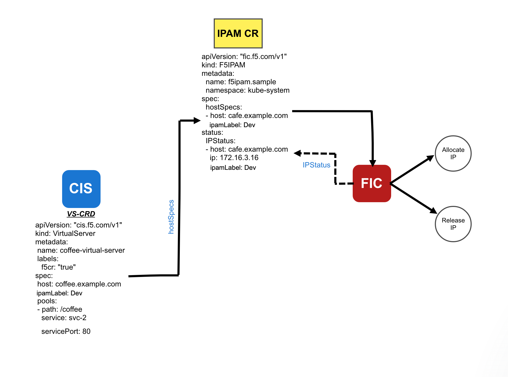

# F5 IPAM Controller

The F5 IPAM Controller is a Docker container that runs in an orchestration environment and interfaces with an IPAM system.
It allocates IP addresses from an IPAM system’s address pool for hostnames in an orchestration environment.
The F5 IPAM Controller watches orchestration-specific resources and consumes the hostnames within each resource.

# In this IPAM

The F5 IPAM Controller can allocate IP address from static IP address pool based on the ipamLabel mentioned in a Kubernetes resource The idea here is that we will support CRD, Type LB and probably also in the future route/ingress. We should make it more generic so that we don't have to update this later, F5 IPAM Controller decides to allocate the IP from the respective IP address pool for the hostname specified in the virtualserver custom resource.

Supported kubernetes resource : 
| RESOURCES | MINIMUM VERSION SUPPORTED |
| ------ | ------ |
| VS CRD | CIS v2.2.2 | 


# Setup Diagram and Details

### Architectural diagram of how F5-IPAM-Controller(FIC) fits in the environment


The F5 IPAM Controller acts as an interface to CIS to provide an IP address from a pool of IP's to each hostname provided in the virtual server CRD.

### Flow Chart for CIS-FIC working 


### F5 IPAM Deploy Configuration Options

**Deployment Options**

| PARAMETER | TYPE | REQUIRED | DESCRIPTION |
| ------ | ------ | ------ | ------ |
| orchestration | String | Required | The orchestration parameter holds the orchestration environment i.e. Kubernetes. |
| ip-range | String | Required |  ip-range parameter holds the IP address ranges and from this range, it creates a pool of IP address range which gets allocated to the corresponding hostname in the virtual server CRD |
| log-level | String | Optional |  Log level parameter specify various logging level such as DEBUG, INFO, WARNING, ERROR, CRITICAL. |

Note: On how to configure these Configuration Options, please refer to IPAM Deployment YAML example in below.

### Installation
#### RBAC -  ServiceAccount, ClusterRole and ClusterRoleBindings for F5 IPAM Controller

```
kind: ClusterRole
apiVersion: rbac.authorization.k8s.io/v1
metadata:
  name: ipam-ctlr-clusterrole
rules:
  - apiGroups: ["fic.f5.com"]
    resources: ["f5ipams"]
    verbs: ["get", "list", "watch", "update", "patch"]
---
kind: ClusterRoleBinding
apiVersion: rbac.authorization.k8s.io/v1
metadata:
  name: ipam-ctlr-clusterrole-binding
  namespace: kube-system
roleRef:
  apiGroup: rbac.authorization.k8s.io
  kind: ClusterRole
  name: ipam-ctlr-clusterrole
subjects:
  - apiGroup: ""
    kind: ServiceAccount
    name: ipam-ctlr
    namespace: kube-system
---
apiVersion: v1
kind: ServiceAccount
metadata:
  name: ipam-ctlr
  namespace: kube-system
```

#### Example: F5 IPAM Controller Deployment YAML

```
apiVersion: apps/v1
kind: Deployment
metadata:
  labels:
    name: f5-ipam-controller
  name: f5-ipam-controller
  namespace: kube-system
spec:
  replicas: 1
  selector:
    matchLabels:
      app: f5-ipam-controller
  template:
    metadata:
      labels:
        app: f5-ipam-controller
    spec:
      containers:
      - args:
        - --orchestration=kubernetes
        - --ip-range='{"Dev":"172.16.3.21-172.16.3.30","Test":"172.16.3.31-172.16.3.40", 
                       "Production":"172.16.3.41-172.16.3.50","Default":"172.16.3.51-172.16.3.60"}'
        - --log-level=DEBUG
        command:
        - /app/bin/f5-ipam-controller
        image: f5networks/f5-ipam-controller
        imagePullPolicy: IfNotPresent
        name: f5-ipam-controller
      serviceAccount: ipam-ctlr
      serviceAccountName: ipam-ctlr
```

#### Deploying RBAC and F5 IPAM Controller 

Using kubectl let's apply the above defined RBAC and Deployment definitions.

```
kubectl create -f f5-ipam-rbac.yaml
kubectl create -f f5-ipam-deployment.yaml
```


### Configuring CIS to work with F5 IPAM Controller

To configure CIS to work with the F5 IPAM controller, the user needs to give a parameter ```--ipam=true``` in the CIS deployment and also provide a parameter ```ipamLabel``` in the Kubernetes resource.

#### Examples

**Virtual Server CRD**

```
apiVersion: "cis.f5.com/v1"
kind: VirtualServer
metadata:
 name: coffee-virtual-server
 labels:
   f5cr: "true"
spec:
 host: coffee.example.com
 ipamLabel: Dev
 pools:
 - path: /coffee
   service: svc-2
   servicePort: 80
```

**CIS Deployment with ipam enabled**

```
apiVersion: extensions/v1beta1
kind: Deployment
metadata:
  name: k8s-bigip-ctlr-deployment
  namespace: kube-system
spec:
  replicas: 1
  template:
    metadata:
      name: k8s-bigip-ctlr
      labels:
        app: k8s-bigip-ctlr
    spec:
      serviceAccountName: bigip-ctlr
      containers:
        - name: k8s-bigip-ctlr
          image: "f5networks/k8s-bigip-ctlr"
          command: ["/app/bin/k8s-bigip-ctlr"]
          args: [
            "--bigip-username=$(BIGIP_USERNAME)",
            "--bigip-password=$(BIGIP_PASSWORD)",
            "--bigip-url=<ip_address-or-hostname>",
            "--bigip-partition=<name_of_partition>",
            "--pool-member-type=nodeport",
            "--agent=as3",
            "--ipam=true", //Enable IPAM 
            ]
      imagePullSecrets:
        - name: f5-docker-images
        - name: bigip-login
```


#### NOTE: 
- If the user provides the parameter ```--ipam=true``` in the CIS deployment then it is mandatory to provide the ```ipamLabel``` parameter in VS CRD to leverage the the IPAM Controller.
- If a VirtualServer Address is specified in the resource, CIS don't leverage the IPAM Controller even if ```ipamLabel```  parameter is specified
- If No VirtualServer Address is specified in the resource and ```ipamLabel``` parameter is specified, CIS will leverage the IPAM Controller for allocation of IP address.


### Updating the Status in Virtual Server CRD


The main aim of IPAM is to provide an IP address corresponding to each hostname provided in the VS CRD.

The user needs to mandatorily provide the host and ipamLabel in the hostSpecs section of F5-CR. The F5 IPAM Controller, in turn, reads the hostSpecs of CR, processes it, and updates the IPStatus with each host provided in the hostSpecs with host, IP(which is generated from the range of IP address by FIC), and corresponding ipamLabel.

- F5-ipam-controller (FIC) acts as a communication channel for updating the host, IP, and ipamLabel in VS CRD.

Below is the example of F5-CR for Virtual Server: 

- f5-ipam-cr-vs.yaml

```
apiVersion: "fic.f5.com/v1"
kind: F5IPAM
metadata:
  name: f5ipam.sample
  namespace: kube-system
spec:
  hostSpecs:
  - host: cafe.example.com
    ipamLabel: Dev
  - host: tea.example.com
    ipamLabel: Test
status:
  IPStatus:
  - host: cafe.example.com
    ip: 172.16.3.16
    ipamLabel: Dev
  - host: tea.example.com
    ip: 10.192.75.114
    ipamLabel: Test
```

### Updating the Status in Transport Server CRD

The user needs to mandatorily provide ipamLabel in the hostSpecs section of F5-CR. The F5 IPAM Controller, in turn, reads the hostSpecs of CR, processes it, and updates the IPStatus with each ipamlabel provided in the hostSpecs with IP(which is generated from the range of IP address by FIC), and corresponding ipamLabel and key which is the combination of `<namespace>/<ts_crd_name>_ts`

- F5-ipam-controller (FIC) acts as a communication channel for updating the IP,ipamLabel and key in TS CRD.

Below is the example of F5-CR for Transport Server:

- f5-ipam-cr-ts.yaml

```
apiVersion: "fic.f5.com/v1"
kind: F5IPAM
metadata:
  name: f5ipam.sample
  namespace: kube-system
spec:
  hostSpecs:
  - ipamLabel: Production
    key: default/test-cr-ts1_ts
  - ipamLabel: Test
    key: default/test-cr-ts_ts
status:
  IPStatus:
  - ip: 172.16.3.16
    ipamLabel: Production
    key: default/test-cr-ts1_ts
  - ip: 10.192.75.114
    ipamLabel: Test
    key: default/test-cr-ts_ts
```

 ### Limitations

1. Single IPAM Controller does not work with multiple CIS deployments.
2. Sometimes IPAM misses allocating an IP for a domain when CIS is restarted.

For 2:  
Mitigation: In this case, the user can delete the F5-IPAM custom resource from kube-system named `"ipam.<Partition_Name>"` and restart both the controller.

`kubectl delete f5ipam ipam.<Partition_Name> -n kube-system`


### Known Issue
- Observing error log when IPAM is not enabled in CIS.

`[ERROR] [ipam] error while retriving IPAM namespace and name.`

- IPAM Controller logs does not contain any build information
